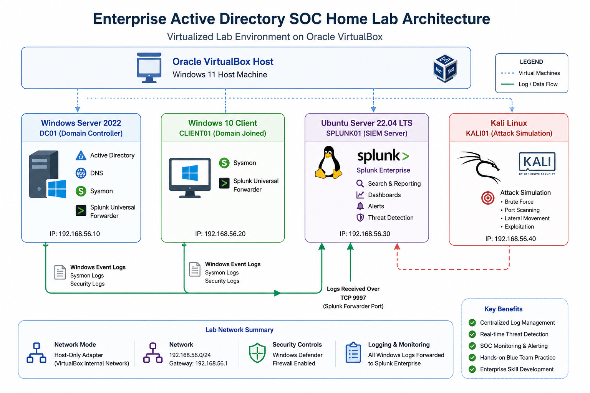

# Enterprise Active Directory SOC Home Lab


> **Enterprise Active Directory SOC Home Lab** built with **Splunk Enterprise**, **Windows Server 2022**, **Active Directory**, **Sysmon**, and **Splunk Universal Forwarders** to simulate a real-world Security Operations Center (SOC). This project demonstrates centralized log collection, Windows event analysis, detection engineering, dashboard creation, and security monitoring in an isolated enterprise lab environment.

## Project Overview

This project demonstrates the design and operation of an enterprise-style Security Operations Center home lab using Splunk Enterprise, Windows Server 2022, Active Directory, Sysmon, Windows Event Logs, and Splunk Universal Forwarders.

The lab was built to simulate a small corporate Windows environment, collect endpoint telemetry, analyze security events, create SOC dashboards, and develop detection use cases based on common Windows security activity.

## Objectives

- Build and configure a Windows Active Directory environment
- Centralize Windows security logs in Splunk Enterprise
- Deploy Splunk Universal Forwarders to Windows endpoints
- Collect enhanced endpoint telemetry using Sysmon
- Monitor authentication and administrative activity
- Create SOC dashboards and detection searches
- Simulate security events and validate detections
- Develop practical blue-team and SIEM experience

  ## 🏗️ Lab Architecture

The following diagram illustrates the enterprise-style Active Directory SOC lab used throughout this project.



## Lab Environment

| System | Role |
|---|---|
| Windows Server 2022 | Active Directory Domain Controller |
| Windows 10 | Domain-joined endpoint |
| Ubuntu Server | Splunk Enterprise server |
| Kali Linux | Security testing workstation |
| Metasploitable2 | Vulnerable testing system |
| Oracle VirtualBox | Virtualization platform |

## Technologies Used

- Splunk Enterprise
- Splunk Universal Forwarder
- Microsoft Active Directory
- Windows Server 2022
- Windows 10
- Ubuntu Server
- Sysmon
- Windows Event Logs
- PowerShell
- Oracle VirtualBox
- Kali Linux

## Data Flow

```text
Windows Server 2022 (DC01)
        |
        | Windows Event Logs and Sysmon
        v
Splunk Universal Forwarder
        |
        | TCP 9997
        v
Ubuntu Splunk Enterprise Server
        ^
        | TCP 9997
        |
Splunk Universal Forwarder
        ^
        | Windows Event Logs and Sysmon
        |
Windows 10 Client (WIN10-CLIENT01)

Julio E. Betancourt Jr  
Cybersecurity Graduate Student  
GitHub: https://github.com/SilentIOC
